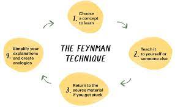
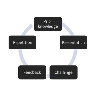
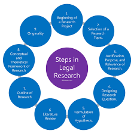

## Question 1
## What is the Feynman Technique? Paraphrase the video in your own words.
The learning and study technique known as the Feynman Technique was created by the Nobel Prize–winning physicist Richard Feynman. It is intended to support students in fully grasping difficult ideas and properly retaining the knowledge. The technique consists of four easy steps:

- Pick a notion or subject that interests you.
- As if you were explaining the idea to someone else who was unfamiliar with it, describe it in straightforward terms. Make things simpler to understand by using analogies, concrete examples, and ordinary language.
- 
- Find any holes in your argument or places where it was confused or lacking.
To strengthen your comprehension and fill in any gaps.
- Review the original source. Repeat this process of explanation until you are confident in your ability to communicate the idea simply.

  
<td align="center"> 

The Feynman Technique promotes active learning and compels students to examine their own conceptualizations of a topic. Learners can identify areas that require additional explanation by simplifying complicated ideas, which enables them to build a more thorough knowledge of the subject matter. It is an effective tool for both students and anyone trying to understand different things better.

## Question 2
## What are the different ways to implement this technique in your learning process?
Using the Feynman Technique in your learning process requires implementing a number of techniques to successfully comprehend and remember difficult ideas. Here are several variations on how to use the technique:

- Select a range of subjects: Choose a variety of themes from various subjects that you wish to learn more about or better comprehend. Anything from historical occurrences to scientific ideas or even practical skills could be included.

- Begin with the fundamentals: Start by learning the guiding principles and essential ideas of the subject of your choice. Prior to exploring more complex themes when learning a new subject, concentrate on laying a solid foundation.

- Take notes as you learn: Write down your thoughts as you take notes. Write down pertinent instances, summarize the main themes, and explain complicated concepts using analogies.

- When you try to teach the information to yourself or others in the future, this method of taking notes will be helpful to you.

- Teach the idea to a different person: Imagine you are discussing the idea to a friend, member of your family, or even a hypothetical audience. Speak aloud or jot down your justification. You are compelled to clarify your comprehension and pinpoint where you need to improve by this act of teaching.

<td align="center"> 

- Create charts, infographics, or other visual representations of the material as visual aids. Visual aids can improve comprehension and make it simpler to describe intricate relationships between various aspects.

- After describing a topic, ask for others' opinions on it. This can be done by participating in study groups, having conversations with peers, or even posting your justifications online. You can improve your understanding and clear up any misunderstandings by getting feedback.

- Review and refine: Return to the original material and go through the sections where you had trouble explaining them or where comments indicated they could be improved. Until you can do so fluidly and coherently, practice explaining the notion.

- Be persistent and curious: Adopt a curious attitude and continue to investigate the subject from many angles. Be tenacious in Embrace your learning process and don't let early difficulties deter you. You'll gain a deeper comprehension of the issue with time.

- Relate the new material to what you already know by making connections between it and your prior knowledge. Establishing links between ideas strengthens your understanding and enhances memory recall.

- Use the information: Put the ideas into practice towards the end. Your learning is reinforced and your ability to internalize the information is improved when you solve issues, carry out experiments, or use the knowledge in practical situations.

- You can apply the Feynman Technique and improve your comprehension and mastery of numerous disciplines by incorporating these methods into your learning process.

## Question 3
## Paraphrase the video in detail in your own words.

The well-known online course "Learning How to Learn" was developed by Dr. Barbara Oakley, a professor, writer, and educator in the field of engineering. . It explores several learning techniques using knowledge from cognitive psychology and neuroscience. 

- Dr. Oakley contrasts focused and diffused thinking, describing focused thinking as requiring intense focus on a single activity and diffused thinking as allowing the brain to make connections and analyze information in the background. Having knowledge of how to change between these modesenhances learning.

- Chunking: Making complex information easier to understand and retain by dividing it into smaller, more manageable bits. Learners can lay a strong basis for further understanding by grouping knowledge into meaningful categories.

- The Pomodoro Technique divides study or work sessions into brief, concentrated intervals (usually 25 minutes), followed by a brief respite. Taking regular pauses keeps the mind sharp and prevents burnout.

- Active memory retrieval and spaced repetition: Active memory retrieval improves learning. The course includes strategies like flashcards and spaced repetition, in which students go over content more than once at gradually longer intervals to help them remember it.

- Dr. Oakley talks about the effectiveness of diagrams, mind maps, and other visual aids in promoting comprehension and memory. These resources aid students in connecting ideas in their minds.

- Overcoming Procrastination: The course discusses typical roadblocks like procrastination and provides solutions, like the "Two-Minute Rule" to start work.

- Memory Techniques: The course covers mnemonic devices and memory palaces, which aid students in remembering knowledge by linking it with vivid imagery and physical locations.

- Dr. Oakley highlights the significance of sleep for strengthening memory. Quality The brain's capacity to store and organize freshly learned information is supported by high-quality rest.

- Learning and mentality: Having a growth mindset, or the conviction that aptitudes can be acquired through effort, enables students to rise to obstacles and see setbacks as opportunities to improve.

The widely accepted popularity of "Learning How to Learn" can be attributed to its pragmatic and fact-based approach to learning. The course is offered on a variety of online learning platforms, and it has helped countless people advance their knowledge and abilities. If you want to learn more about the subject, I advise taking the course or looking for resources by Dr. Barbara Oakley.

## Question 4
## What are some of the steps that you can take to improve your learning process?

Your learning process must be improved if you want to acquire knowledge quickly and effectively. The following actions can be taken to improve your educational experience:

- Establish precise objectives: Establish clear, attainable learning goals. You may maintain motivation and focus by being aware of what you want to learn and why.

- Make a study schedule: A structured study schedule can help you to stay organized while you learn. Establish a timetable that works best for you by setting up time for various subjects or topics.

- Utilize active learning strategies: Participate in the learning process by summarizing, instructing others, taking notes, and asking questions. Better knowledge and retention are encouraged by active learning.

- Determine your preferred method of learning: Find your preferred learning mode, whether it is visual, aural, kinesthetic, or a combination of them. Adapt your study approaches that fit your preferred manner.

- Practice frequently: Repetition and regular practice are essential for memory consolidation. To solidify your knowledge, occasionally review previously learnt topics.

<td align="center"> 

- Look for a supportive environment: To reduce distractions and improve attention, pick a peaceful, cozy location to study.

- Take breaks: Dividing your study time into manageable halves and adding brief pauses in between will help. This lessens the risk of burnout and improves memory.

- Use mnemonic tools: Mnemonics, such acronyms or rhymes, can make it easier for you to recall complicated material.

- Make use of digital technologies, instructional apps, and online learning opportunities to gain access to a wide range of learning resources.

- Find study partners or join study groups: Working together with others can open up new ideas and promote a positive learning atmosphere.

- Keep an open mind and ask questions: Approach learning with curiosity and a desire to investigate novel concepts. Never be afraid to clarify things and ask questions when required.

- Examine your progress and consider the lessons you've learnt as you go along. Determine where you need to improve and change your study methods accordingly.

- Metacognition practice: Be conscious of your thought processes and keep a close eye on your comprehension of the subject. If you realize that some learning strategies aren't effective, change them.

- Maintain a balanced lifestyle with frequent exercise, a good diet, and adequate sleep to stay physically and mentally well. Better learning outcomes are supported by physical and mental health.

- Accept mistakes as opportunities to learn: Don't let blunders demoralize you; instead, see them as chances for development.

## Question 5
## Your key takeaways from the video? Paraphrase your understanding.

Josh Kaufman challenges the conventional wisdom that learning a skill takes a great deal of practice in his book "The First 20 Hours: How to Learn Anything" by presenting a persuasive idea. Instead, he suggests that you can achieve a level of proficiency in just 20 hours of focused, purposeful learning.

- Clear goals and a well-structured learning plan are the cornerstones of Kaufman's strategy. You can prioritize what to learn first and focus on the most important features by dissecting the skill into its constituent parts. The importance of active learning is highlighted since it fosters quicker learning and greater memory.

- The secret is to accept your pain at first and push through the steep learning curve. Kaufman advises students to practice regularly in brief, concentrated bursts,enabling more efficient advancement. He also stresses the value of accessing resources like tutorials and internet forums or asking expert people for their opinion.

It's important to understand that the 20-hour rule is merely a guide to help you reach a level of expertise that's suitable for your needs rather than a guarantee of mastery. Higher degrees of expertise still require continued practice and improvement.

## Question 6
## What are some of the steps that you can while approaching a new topic?

It can be difficult to approach a new subject, but by using a methodical approach, you can make the learning process more successful and manageable. When approaching a new topic, keep the following steps in mind:

- Research and Information Gathering: Start by doing some initial research on the subject. To get a general overview of the topic, consult reliable sources such books, journals, and online resources.

- Establish Specific Learning Objectives: Specify the results you hope to obtain with this new subject. Establish measurable learning goals that will direct your studies.

- Break the issue Down: Separate the issue into more manageable, smaller sub-topics. By breaking it down, you'll feel less overwhelmed and be able to concentrate on one thing at a time.

- Establish a StudyCreate a schedule for your study time that specifies what you will learn and when. Set time aside for each subtopic and give yourself deadlines.

- First, the Foundations: Get a firm grasp on the fundamental ideas and principles of the subject as you start your learning process. This will offer a strong basis for more investigation.

<td align="center"> 

- Use a Variety of Learning Resources: Spread out the sources you use to learn. Combine reading materials with online courses, movies, podcasts, and other resources to learn about the topic from several angles.

- Take Organized Notes and Write Summaries: As you study, write summaries to help you remember what you've learned and to make future reviews easier.

- Actively participate in the learning process by engaging in active learning. Ask questions, work out issues, and use the information in practical circumstances. Understanding and retention are improved by active learning.

- Seek Clarification: When faced with challenging ideas or perplexing facts, don't be afraid to ask for assistance or clarification. Ask for help from your instructors, peers, or online forums.

- Test Yourself: Conduct periodic assessments of your development through the completion of quizzes, exams, or practice exercises. Self-evaluation identifies areas that require additional development.

- Be Patient and Consistent: Keep in mind that learning takes time. Don't let brief setbacks derail your study regimen; instead, be persistent.

- Relate the new subject to what you already know by connecting new knowledge with prior knowledge. Learning becomes more relevant when linkages are made with previously learned ideas.

- Teach Others: Sharing your information with others is an effective technique to reinforce your comprehension and spot any knowledge gaps.
Reflect on Your Learning: Frequently consider the experiences and progress you have made in learning. Take into account the tactics that have the best results for you and any potential improvement areas.

- appreciate Your Success: Throughout the learning process, be sure to recognize and appreciate your successes. You can stay motivated by receiving praise.

Keeping in mind that everyone learns in a unique way, modify these instructions to suit your chosen method. A more rewarding and enjoyable learning experience will result from approaching a new subject with curiosity and an open mind.

## Reference
- [Tedx Talks](https://www.youtube.com/watch?v=5MgBikgcWnY)
- [Thomas Frank](https://www.youtube.com/watch?v=_f-qkGJBPts)
- [Google](https://www.indeed.com/career-advice/career-development/learn-new-skills)