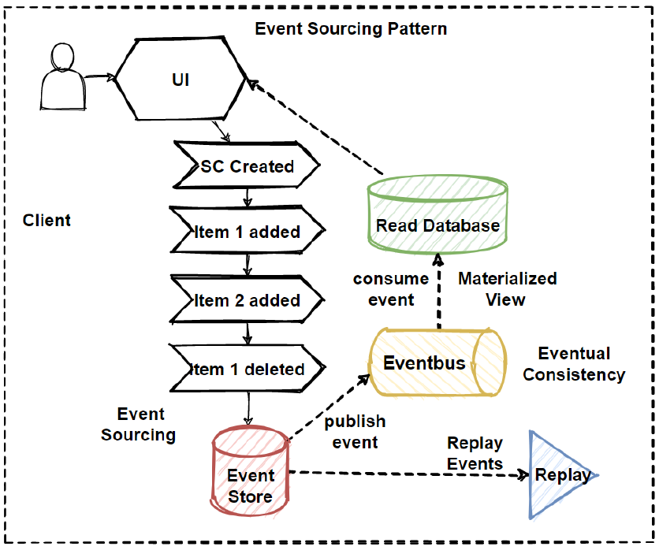
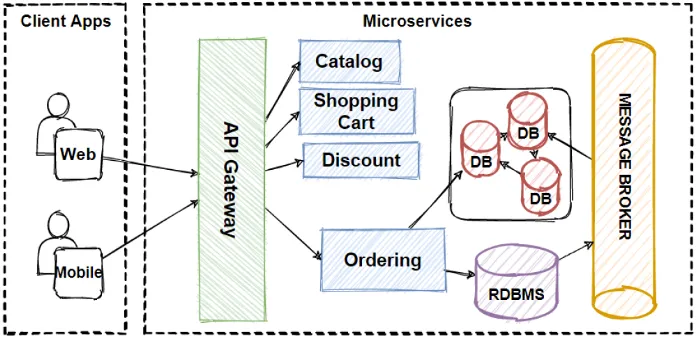

# Event Sourcing

## Inroduction💡
Event sourcing views an application's state as a series of immutable occurrences. Events representing specific state-changing actions are appended to an event log or event storage rather than affecting the application's state directly. By replaying the events in chronological order, this log may be used to reconstruct the current state of the program and acts as the source of truth for its state.

## Event Capture and Storage💡
 An event is created and added to the event log whenever an action within the program results in a state change. Each event offers in-depth details about the activity and how it affected the state of the application. For instance, information like the account ID, owner's name, and starting balance may be present in a "AccountCreated" event. The event log provides the events' durability and permanence, frequently utilizing a relational database, a NoSQL database, a file system, or a special event store.

 ## State reconstruction💡

 All events in the event log are played again in the order they occurred in order to determine the application's present state. Each event is handled in turn, changing the state once it has been initially created from an empty state. The process of replaying an event, also known as playback, enables an application to arrive at the desired state at any given time. Historical views, audits, and analysis are made feasible by reconstructing the state from the event log.

## Diagram 💡

<td align="center"> 

</td>
- Design the Architecture — CQRS, Event Sourcing, Eventual Consistency, Materialized View

  
<td align="center"> 

</td>

## Event sourcing has various advantages for software development, including the following💡
- Historical Perspective: 
  Using event sourcing, the application's state at any earlier moment can be recreated. This feature makes it possible to analyze previous data, do retrospective bug-fixing, and respond to inquiries regarding earlier states and activities.
-  Auditability: 
  The event log serves as an exhaustive audit trail, recording all system changes and actions. For compliance, regulatory needs, and troubleshooting, this trail can be extremely helpful.
- Scalability and Performance: Because events are simply added to the log, event sourcing effectively manages heavy write loads. Additionally, event replay can be split amongst several nodes, ensuring scalability and better performance.

Events are distinct acts that can be handled in a variety of ways across time. 

## Challenges and Considerations 💡
Even though event sourcing has several advantages, there are a few things to take into account:
- Complexity: When compared to conventional CRUD-based methods, event sourcing implementation is more difficult. Event handling, event replay, and eventual consistency management can be challenging jobs that demand careful planning and execution.

- Event Schema Evolution: Altering the way an event is structured can affect how replaying earlier events works. In order to guarantee a smooth progression of the system, backward compatibility and support for various event versions must be taken into account.

- Storage Requirements: To efficiently handle high amounts of events, the event log can expand dramatically over time, demanding appropriate storage and management solutions.

- Troubleshooting and Debugging: Event-based systems can be more difficult to troubleshoot because the application's

## Learning Resources 💡

- [YouTube](https://youtu.be/i2eVTk2Fb40)
- [Google](https://microservices.io/patterns/data/event-sourcing.html#:~:text=Event%20sourcing%20persists%20the%20state,operation%2C%20it%20is%20inherently%20atomic.)
- [Red Hat](https://www.redhat.com/architect/pros-and-cons-event-sourcing-architecture-pattern)

<!-- CONTACT -->
## Contact 💡

- Name : Samar Mahato 
- Twitter [@SamarMa61979073](https://twitter.com/SamarMa61979073) 
- Email samarmahato2520@gmail.com

## Project Admin 💡

<td align="center"> 
	<b>Samar Mahato</b>
</td>
